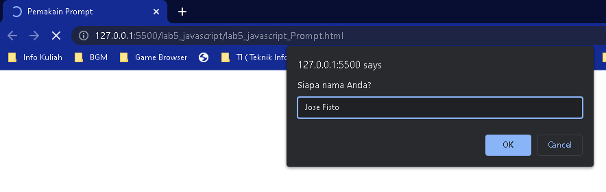
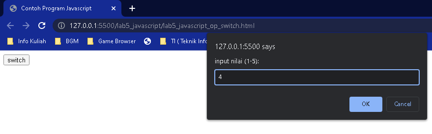

<p align="center">
	PEMROGRAMAN WEB
</p>
<p align="center">
	TUGAS PRATIKUM 5
</p>
<p align="center">
	Dosen Pengampu : Agung Nugroho, M.Kom
</p>
<p align="center"> 
	<b>Tugas untuk memenuhi syarat penilain pada Pert-6</b>
</p>

<p align="center">
	
</p>

<p align="center">
                 Nama  : Jose Fisto
</p>
<p align="center">
                 NIM   : 312010119
</p>
<p align="center">
                 Kelas : TI.20 A.1
</p>

<br/>
<br/>

<p align="center">
	<b>UNIVERSITAS PELITA BANGSA</b>
</p>
<p align="center">
	<b>FAKULTAS TEKNIK</b>
</p>
<p align="center">
	<b>TEKNIK INFORMATIKA</b>
</p>
<p align="center">
	<b>TA 2021 / 2022</b>
</p>

<br></br>

<hr>
</hr>

<br></br>

# Laporan Praktikum 5 - Javascript

## Buka Aplikasi / Software Editor
Siapkan aplikasi / software editor **Visual Studio Code**

<p align="center">
	
</p>

Kemudian buat folder baru dengan nama **lab5_javascript**

<p align="center">
	
</p>

## Kerangka HTML

Pertama buat file baru pada folder sebelumnya dengan nama **lab5_javascript.html**

File pertama dengan kode sebagai berikut

```html
<!DOCTYPE html>
<html lang="en">
<head>
 <title>Mengenal JavaScript</title>
</head>
<body>
 <h1>Pengenalan JavaScript</h1>
 <h3>Contoh document.write dan console.log</h3>
 <script>
 document.write("Hello World");
 console.log("Hello World");
 </script>
</body>
</html>
```
Output :

<p align="center">
	
</p>

## Javascrip Dasar

Pemakaian Alert sebagai property window

File kedua **lab5_javascript_Alert.html**
```html
<!DOCTYPE html>
<html>
    <head>
        <title>Alert Box</title>
    </head>
    <body>
        <script type="text/javascript">
        <!--
        window.alert("Perhatian pesan ini untuk Anda!!");
        //-->
        </script>
    </body>
</html>
```
fungsi alert untuk menghasilkan keluaran berupa pesan khusus dengan menampilkan pop up jendela pada layar yang ditujukan kepada pengguna.

Output :

<p align="center">
	
</p>

### Pemakaian metode dalam objek

File ketiga **lab5_javascript_Method.html**

```html
<!DOCTYPE html>
<html>
    <head>
        <title>Skrip Javascript</title>
        </head>
        <body>
            <script type="text/javascript">
            <!--
            document.write("<br>Semangat pelajari JavaScript<br/>");
            document.write("<br><b>Ayo bisa!</br></b>");
            //-->
            </script>
    </body>
</html>
```
Menggunakan metode dalam objek untuk mengeksekusi fungsi, untuk metode di haruskan menggunakan tanda kurung, dapat di lihat di atas kode diatas ``document.write("..");``.

Output :

<p align="center">
	
</p>

### Pemakaian Prompt

File keempat **lab5_javascript_Method.html**
```html
<!DOCTYPE html>
<html>
      <head>
          <title>Pemakain Prompt</title>
      </head>
      <body>
          <script language="javascript">
          var nama = prompt("Siapa nama Anda?"," ");
          document.write("Hai, " + nama);
          </script>
        </body>
</html>
```
fungsi ``prompt`` digunakan untuk mengambil data inputan kepada pengguna dengan menampilkan dialog window

Output :

<p align="center">
	
</p>

<p align="center">
	
</p>

### Pembuatan fungsi dan cara pemanggilannya

File kelima **lab5_javascript_func_tag_body.html**
```html
<!DOCTYPE html>
<html>
    <head>
        <title>Fungsi dan Pemanggilannya</title>
            <script type="text/javascript">
                <!--
                function pesan(){
                alert ("memanggil fungsi javascript lewat body onload")
                }
                //-->
            </script>
    </head>
            <body onload=pesan()>
            </body>
</html>
```

Output :

<p align="center">
	
</p>

## Dasar Pemrograman Di Javascript
Operasi dasar aritmatika

File ke Enam **lab5_javascript_Dasar_Aritmatika.html**
```html
<!DOCTYPE html>
<html>
    <head>
        <title>Operasi Dasar Aritmatika</title>
        <script type="text/javascript">
        function test (val1,val2)
        {
            document.write("Penjumlahan : "+val1)
            document.write("+"+val2+" = ")
            document.write(val1+val2+"<br/>")
            document.write("Perkalian : "+val1)
            document.write("*"+val2+" = ")
            document.write(val1*val2+"<br/>")
            document.write("Pengurangan : "+val1)
            document.write("-"+val2+" = ")
            document.write(val1-val2+"<br/>")
            document.write("Pembagian : "+val1)
            document.write("/"+val2+" = ")
            document.write(val1/val2+"<br/>")
            document.write("Modulus : "+val1)
            document.write("%"+val2+" = ")
            document.write(val1%val2+"<br/>")
            }
            </script>
    </head>
            <body>
                <input type="button" name="button1" value="Perhitungan"onClick=test(9,4)>
            </body>
</html>
```

Program di atas merupakan operasi Aritmatika. Angka yang di proses yaitu =test(9,4). Dan output yang di keluarkan ialah hasil dari angka 9 dan 4 dalam perhitungan dan disesuaikan dengan perhitungan secara bergantian apabila telah selesai perhitungan (eksekusian perhitungan aritmatika) hingga sampai tahap penyelesain dan stop.

Output :

<p align="center">
	
</p>

<p align="center">
	
</p>

### Seleksi kondisi (if..else)

File ke Tujuh **lab5_javascript_if-else.html**
```html
<!DOCTYPE html>
<html lang="en">
    <head>
        <meta charset="UTF-8">
        <meta http-equiv="X-UA-Compatible" content="IE=edge">
        <meta name="viewport" content="width=device-width, initial-scale=1.0">
        <title>Contoh if-else</title>
    </head>
    <body>
        <script lang="javascript">
            var nilai = prompt("nilai (0-100): ", 0);
            var hasil = "";
            if (nilai >=60)
            hasil = "lulus";
            else
            hasil = "tidak lulus";
            document.write("hasil: " + hasil);
        </script>
    </body>
</html>
```

Kode program di atas menyatakan dalam kondisi if else untuk menampilkan data output penilain.

Output :

<p align="center">
	
</p>
<p align="center">
	
</p>

Data program di atas menampilkan bahwa apabila menginput nilai kurang dari < 60, maka kondisi yang di keluarkan ialah ``else`` / tidak lulus < 60

<p align="center">
	
</p>
<p align="center">
	
</p>

Dan apabila nilai atau values di atas atau > 60, maka kondisi tersebut di nyatakan lulus 

### Penggunaan operator switch untuk seleksi kondisi

File ke Delapan **lab5_javascript_op_switch.html**
```html
<!DOCTYPE html>
<html lang="en">
    <head>
        <meta charset="UTF-8">
        <meta http-equiv="X-UA-Compatible" content="IE=edge">
        <meta name="viewport" content="width=device-width, initial-scale=1.0">
        <title>Contoh Program Javascript</title>
            <script lang="javascript">
                function test ()
                {
                    val1=window.prompt("input nilai (1-5):")
                    switch (val1)
                    {
                        case "1" :
                            document.write("bilangan satu")
                            break
                        case "2" :
                            document.write("bilangan dua")
                            break
                        case "3" :
                            document.write("bilangan tiga")
                            break
                        case "4" :
                            document.write("bilangan empat")
                            break
                        case "5" :
                            document.write("bilangan lima")
                            break 
                        default  :
                            document.write("bilangan lainnya")
                    }
                }
            </script>
    </head>
    <body>
        <input type="button" name="button1" value="switch" onclick=test()>
    </body>
</html>
```

Fungsi switch di gunakan untuk data value yang di input kemudian diubah atau dikonversikan dalam bentuk lain. penggunaan fungsi switch di haruskan menggunakan fungsi case dan default.

Output :

<p align="center">
	
</p>

<p align="center">
	
</p>

<p align="center">
	
</p>

### Pembuatan Form

#### Form Input

File ke Sembilan **lab5_javascript_form_input.html**
```html
<!DOCTYPE html>
<html lang="en">
    <head>
        <meta charset="UTF-8">
        <meta http-equiv="X-UA-Compatible" content="IE=edge">
        <meta name="viewport" content="width=device-width, initial-scale=1.0">
        <title>Form input</title>
        <script lang="javascript">
            function test () {
                var val1=document.kirim.T1.value
                if (val1%2==0)
                    document.kirim.T2.value="bilangan genap"
                else
                    document.kirim.T2.value="bilangan ganjil"
            }
        </script>
    </head>
    <body>
        <form action="" method="post" name="kirim">
            <p>BIL <input type="text" name="T1" id="T1" size="20"> MERUPAKAN BIL <input type="text" name="T2" id="T2" size="20"></p>
            <p><input type="button" value="TEBAK" name="B1" onclick=test()></p>
        </form>
    </body>
</html>
```

Pernyataan kode di atas :
- Menginput data melalui tag body ``bil`` kemudian ``onclick``, maka script akan memproses data tersebut.
- tag function, sub tag var = mengenali / memproses dimana val1 merupakan data input dari tag form pada kerangka tag body
- jika (val1%2==0) himpunan nilai genap akan di nyatakan "bilangan genap"
- jika tidak / apabila kondisi lainnya di temukan nilai ganjil akan di nyatakan "bilangan ganjil"

Output :

<p align="center">
	
</p>

<p align="center">
	
</p>

#### Form Button

File Ke Sepuluh **lab5_javascript_form_button.html**
```html
<!DOCTYPE html>
<html lang="en">
    <head>
        <meta charset="UTF-8">
        <meta http-equiv="X-UA-Compatible" content="IE=edge">
        <meta name="viewport" content="width=device-width, initial-scale=1.0">
        <title>Objek Document</title>
    </head>
    <body>
        <script lang="javascript">
            function ubahWarnaLB(warna) {
                document.bgColor = warna;
            }
            function ubahWarnaLD(warna) {
                document.fgColor = warna;
            }
        </script>
        <h1>Tes</h1>
        <form action="">
            <input type="button" value="Latar Belakang Hijau" onclick="ubahWarnaLB('GREEN')">
            <input type="button" value="Latar Belakang Putih" onclick="ubahWarnaLB('WHITE')">
            <input type="button" value="Teks Kuning" onclick="ubahWarnaLD('YELLOW')">
            <input type="button" value="Teks Biru" onclick="ubahWarnaLD('BLUE')">
        </form>
        <script lang="javascript">
            document.write("Dimodifikasi terakhir pada " + document.lastModified);
        </script>
    </body>
</html>
```

Pernyataan kode di atas untuk memanggil fungsi saling memanggil :
- dalam tag form dengan atribut action sebagai di olah dan di submit data tersebut
- dalam tag input di beri atribut type button untuk memicu reaksi terjadi disaat memproses data, dengan tag value atau dalam bentuk teks, dan menggunakan atribut onclick dengan isikan data deskripsi sebagai pemanggil dan kemudian mengisi parameter dengan kode warna
- pada tag function dalam tag script atau jvskrip memanggil data atribut ``onclick``, apabila memicu efek di saat pengguna mengklik.

Output :

<p align="center">
	
</p>

### HTML DOM
Pilihan menggunakan checkBox dengan perhitungan otomatis

```html
<!DOCTYPE html>
<!-- file daftar menu.html -->
<html lang="en">
    <head>
    <meta charset="UTF-8">
    <meta http-equiv="X-UA-Compatible" content="IE=edge">
    <meta name="viewport" content="width=device-width, initial-scale=1.0">
    <title>Daftar Menu</title>
    <script lang="javascript">
        function hitung(ele) {
            var total = document.getElementById('total').value;
                total = (total ? parseInt(total) : 0);
            var harga = 0;
            if (ele.checked) {
                harga = ele.value;
                total += parseInt(harga);
            } else {
                harga = ele.value;
                if (total > 0)
                    total -= parseInt(harga);
            }
            document.getElementById('total').value = total;
        }
    </script>
    </head>
    <body>
    <h1>Daftar Menu Makanan</h1>
    <label><input type="checkbox" value="5000" name="menu1" id="menu1" onclick="hitung(this);">Ayam Goreng Rp. 5.000</label><br>
    <label><input type="checkbox" value="500" name="menu2" id="menu2" onclick="hitung(this);">Tempe Goreng Rp. 500</label><br>
    <label><input type="checkbox" value="2500" name="menu3" id="menu3" onclick="hitung(this);">Telur Dadar Rp. 2.500</label><hr>
    <strong>Total Bayar: Rp. <input type="text" name="total" id="total"></strong>
    </body>
</html>
```

Pada tab label dan tag input saling memanggil dengan javascript :
- pada tag label pada tag input menggunakan atribut checkbox untuk multi seleksi data, dan pada atribut onclick memberikan deskripsi sebagai pemanggil / pemprosesan
- this menetapkan diri sebagai objek pemilik dari suatu baris

Output :

<p align="center">
	
</p>

## Pertanyaan dan Tugas
1. Buat script untuk melakukan validasi pada isian form.
